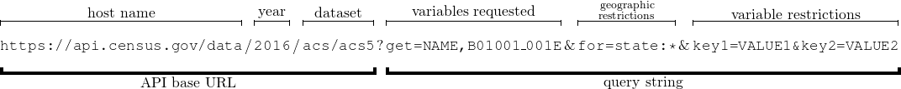

# American Community Survey API
I chose to explore the American Community Survey, one of the [several datasets](https://www.census.gov/data/developers/data-sets.html) provided by the U.S. Census Bureau. In particular, all my examples will focus on the [5-year ACS data](https://www.census.gov/data/developers/data-sets/acs-5year.html)  from the period 2011-2016.

### Components of a Query

The above URL will get the 5-year data profile (2011-2016). Other examples of possible datasets are `acs/acs1` or `acs/acs3` for 1-year or 3-year data respectively, but I focus on 5-year data here since they have the largest sample size. In addition to the standard data tables, the Census Bureau also provides three other types of endpoints:

* comparison profiles (e.g., `acs/acs5/cprofile`), which compare the current year's data to previous 5-year data with statistical significance testing,
* data profiles (e.g., `acs/acs5/profile`), which "contain broad social, economic, housing, and demographic information" as both percentages and gross numbers,
* subject tables (e.g., `acs/acs5/subject`), which provide overall estimates for topics.

More comprehensive documentation (with lots of really nice examples) for usage of all of these is found [here](https://api.census.gov/data/2016/acs/acs5.html). Lists of codes for each variable can be found [here](https://www.census.gov/programs-surveys/acs/technical-documentation/code-lists.html)

There is also a [Python library](https://pypi.python.org/pypi/census/0.5), but since it only has ACS data for 2010 and 2011, all my examples use the regular requests library.

## Examples
### Example 1: Languages in New York City
Suppose we want to count the number of people who speak various languages at homes across New York City.

We can use the endpoint:
```
https://api.census.gov/data/2016/acs/acs5/subject?get=NAME,S1601_C01_001E,S1601_C01_002E,S1601_C01_003E,S1601_C01_004E,S1601_C01_008E,S1601_C01_012E,S1601_C01_016E&for=county:005,047,061,081,085&in=state:36
```
Breaking this down:

* `https://api.census.gov/data/2016/acs/acs5/subject` means that we are getting a subject table from the 5-year ACS (2011-2016).
* We get various variables that we can lookup from the [variable list](https://api.census.gov/data/2016/acs/acs1/subject/variables.html):
	* `NAME`: the canonical name for the geography
	* `S1601_C01_001E`: estimated total population 5 years and older
	* `S1601_C01_002E`: estimated population that speaks only English at home
	* `S1601_C01_003E`: estimated population that speaks a language other than English at home
	* `S1601_C01_004E`: estimated population that speaks Spanish at home
	* `S1601_C01_008E`: estimated population that speaks "other Indo-European languages" at home
	* `S1601_C01_012E`: estimated population that speaks "Asian and Pacific Island languages" at home
	* `S1601_C01_016E`: estimated population that speaks "other languages" at home
* We get data for the five boroughs of New York City (`county:005,047,061,081,085`) in the state of New York (`state:36`).

This will return the following JSON object:
```json
[["NAME","S1601_C01_001E","S1601_C01_002E","S1601_C01_003E","S1601_C01_004E","S1601_C01_008E","S1601_C01_012E","S1601_C01_016E","state","county"],
["Bronx County, New York","1329331","547109","782222","632745","69688","19953","59836","36","005"],
["Kings County, New York","2413001","1297474","1115527","394997","436013","206446","78071","36","047"],
["New York County, New York","1552965","931548","621417","344979","122473","123874","30091","36","061"],
["Queens County, New York","2165377","951842","1213535","513938","344744","314707","40146","36","081"],
["Richmond County, New York","445904","307627","138277","47711","56054","22936","11576","36","085"]]
```

Note that the ACS API likes to use "nonstandard JSON" that represents data in a 2D array. We can use the following Python function to convert data to a more traditional dictionary:
```python
# Function to convert "nonstandard JSON" (2D array) from Census API to real JSON
def convert_json(array):
    json = []
    for i in range(1, len(array)):
        temp = {}
        for j in range(0, len(array[0])):
            temp[array[0][j]] = array[i][j]
        json.append(temp)
    return json
```

We can then calculate percentages of the entire New York City population that speak various languages at home by adding the values for a given variable across the five objects for each borough:
```python
# Function to sum up population values for a given variable
def calculate_pop(variable, data):
    sum = 0
    for i in range(0, len(data)):
        sum += int(data[i][variable])
    return sum

# Example of calculating the total population ages 5+ in NYC
total_pop = calculate_pop("S1601_C01_001E", data_json)
```

This value `total_pop` can then be used to calculate percentages of all sub-populations. We can make a nice table like so:
```python
# Format and print data
template = "{0:25}|{1:10}|{2:20}" # column widths: 25, 10, 20
print(template.format("     NYC POPULATION", "   COUNT", "     PERCENTAGE"))
total_pop = calculate_pop("S1601_C01_001E", data_json)
print(template.format("Total", total_pop, total_pop/total_pop))
temp_pop = calculate_pop("S1601_C01_002E", data_json)
print(template.format("English only", temp_pop, temp_pop/total_pop))
temp_pop = calculate_pop("S1601_C01_003E", data_json)
print(template.format("Not English", temp_pop, temp_pop/total_pop))
temp_pop = calculate_pop("S1601_C01_004E", data_json)
print(template.format("Spanish", temp_pop, temp_pop/total_pop))
temp_pop = calculate_pop("S1601_C01_008E", data_json)
print(template.format("Other Indo-European", temp_pop, temp_pop/total_pop))
temp_pop = calculate_pop("S1601_C01_012E", data_json)
print(template.format("Asian and Pacific Island", temp_pop, temp_pop/total_pop))
temp_pop = calculate_pop("S1601_C01_016E", data_json)
print(template.format("Other", temp_pop, temp_pop/total_pop))
```

The output is as follows:
```
     NYC POPULATION      |   COUNT  |     PERCENTAGE
Total                    |   7906578|                 1.0
English only             |   4035600|  0.5104104455808821
Not English              |   3870978| 0.48958955441911783
Spanish                  |   1934370|  0.2446532494841637
Other Indo-European      |   1028972| 0.13014125706468715
Asian and Pacific Island |    687916| 0.08700552881410896
Other                    |    219720| 0.02778951905615805
```
We can do some basic error-checking: the English-exclusive and the non-English poulations add up to 100%. We also get to make some fun conclusions. For example, we find that non-Spanish Indo-European languages are more common in New York City than Asian and Pacific Island languages!

### Example 2: Median Ages of Racial Populations
Suppose we want to compare the median ages of racial populations in the United States.

We can use the endpoint
```
https://api.census.gov/data/2016/acs/acs5?get=B01002_001E,B01002A_001E,B01002B_001E,B01002C_001E,B01002D_001E,B01002E_001E,B01002F_001E,B01002G_001E,B01002H_001E,B01002I_001E&for=us:*
```

Breaking these down:

* We access the tables for the 5-year ACS for 2011-2016 (`https://api.census.gov/data/2016/acs/acs5`).
* We request values for the median ages of:
	* the total population (`B01002_001E`)
	* white alone (`B01002A_001E`)
	* black or African American alone (`B01002B_001E`)
	* American Indian and Alaska Native (`B01002C_001E`)
	* Asian alone (`B01002D_001E`)
	* Native Hawaiian and other Pacific Islander alone (`B01002E_001E`)
	* some other race alone (`B01002F_001E`)
	* two or more races (`B01002G_001E`)
	* white alone, not Hispanic or Latino (`B01002H_001E`)
	* Hispanic or Latino (`B01002I_001E`)
* We get these numbers for the whole United States (`for=us:*`).

This returns a relatively easy to read 2D array with 1 row for the variables (which demographic) and 1 row for the values (median age):
```
[["NAME","B01001E_001E","B01001E_002E","B01001E_003E","B01001E_004E","B01001E_005E","B01001E_006E","B01001E_007E","B01001E_008E","B01001E_009E","B01001E_010E","B01001E_011E","B01001E_012E","B01001E_013E","B01001E_014E","B01001E_015E","B01001E_016E","B01001E_017E","B01001E_018E","B01001E_019E","B01001E_020E","B01001E_021E","B01001E_022E","B01001E_023E","B01001E_024E","B01001E_025E","B01001E_026E","B01001E_027E","B01001E_028E","B01001E_029E","B01001E_030E","B01001E_031E","B01002E_001E","us"],
["United States","560021","279671","21013","21988","21136","12059","10088","25774","26233","24312","40112","33469","24861","12629","4805","1192","280350","20285","21019","20352","11927","9071","23904","25619","23898","39744","35310","26439","14468","6227","2087","30.8","1"]]
```

When we output the information, we can easily access values in the 2D array since we know the order of the query variables:
```python
# Get the response from the API endpoint
response = requests.get("https://api.census.gov/data/2016/acs/acs5?get=B01002_001E,B01002A_001E,B01002B_001E,B01002C_001E,B01002D_001E,B01002E_001E,B01002F_001E,B01002G_001E,B01002H_001E,B01002I_001E&for=us:*")
data_array = response.json()

# Format and print data (2nd index matches order of query)
template = "{0:50}| {1:12}" # column widths: 50, 12
print(template.format("                    POPULATION", "MEDIAN AGE"))
print(template.format("Total", data_array[1][0]))
print(template.format("White Alone", data_array[1][1]))
print(template.format("Black or African American Alone", data_array[1][2]))
print(template.format("American Indian and Alaskan Native", data_array[1][3]))
print(template.format("Asian Alone", data_array[1][4]))
print(template.format("Native Hawaiian and Other Pacific Islander Alone", data_array[1][5]))
print(template.format("Some Other Race Alone", data_array[1][6]))
print(template.format("Two or More Races", data_array[1][7]))
print(template.format("White Alone, Not Hispanic or Latino", data_array[1][8]))
print(template.format("Hispanic or Latino", data_array[1][9]))
```

This produces the following table:
```
                    POPULATION                    | MEDIAN AGE
Total                                             | 37.7
White Alone                                       | 40.4
Black or African American Alone                   | 33.4
American Indian and Alaskan Native                | 32.2
Asian Alone                                       | 36.5
Native Hawaiian and Other Pacific Islander Alone  | 30.8
Some Other Race Alone                             | 28.9
Two or More Races                                 | 19.8
White Alone, Not Hispanic or Latino               | 43.0
Hispanic or Latino                                | 28.4
```
From this, we can see that, for example, the multiracial population is relatively young, but the non-Hispanic white population is relatively old.

### Example 3: Vietnamese Population by State
Suppose we want to know how many Vietnamese people live in the different states

We can use the endpoint:
```
https://api.census.gov/data/2016/acs/acs5?get=NAME,B01003_001E,B02015_022E&for=state:*
```

Breaking this down:

* As per usual, we use the 5-year ACS data (2011-2012) from `https://api.census.gov/data/2016/acs/acs5`.
* We get the state name (`NAME`), the estimated total population (`B01003_001E`), and the estimated total Vietnamese population (`B02015_022E`).
* We get the data for all states using the wildcard (`for=state:*`).

This returns data that looks like this:
```
[["NAME","B01003_001E","B02015_022E","state"],
["Alabama","4841164","8833","01"],
["Alaska","736855","1134","02"],
["Arizona","6728577","28256","04"],
["Arkansas","2968472","5503","05"],
["California","38654206","632607","06"],
.
.
.
["Wisconsin","5754798","5323","55"],
["Wyoming","583029","417","56"],
["Puerto Rico","3529385","367","72"]]
```

It has rows for the 50 states, Washington, D.C., and Puerto Rico.

We can write a program to calculate percentages like so:
```python
# Get the response from the API endpoint
response = requests.get("https://api.census.gov/data/2016/acs/acs5?get=NAME,B01003_001E,B02015_022E&for=state:*")
data_array = response.json()
data_json = convert_json(data_array)

# Format and print data
template = "{0:25}|{1:10}|{2:24}" # column widths: 25, 10, 25
print(template.format("     STATE/TERRITORY", "   COUNT", "       PERCENTAGE"))
for state in data_json:
    percent = int(state["B02015_022E"])/int(state["B01003_001E"])
    print(template.format(state["NAME"], state["B02015_022E"], percent))
```

This outputs:
```
     STATE/TERRITORY     |   COUNT  |       PERCENTAGE
Alabama                  |8833      |   0.0018245612005707717
Alaska                   |1134      |   0.0015389730679713106
Arizona                  |28256     |    0.004199402042957968
Arkansas                 |5503      |   0.0018538157004681197
California               |632607    |    0.016365799882165476
Colorado                 |22770     |    0.004248693158335192
Connecticut              |8529      |    0.002376712729583093
Delaware                 |1667      |     0.00178346947399954
District of Columbia     |1751      |   0.0026570198586058765
Florida                  |70628     |    0.003543012044826316
Georgia                  |51523     |      0.0051016306048328
Hawaii                   |10766     |    0.007615622566180439
Idaho                    |1718      |    0.001050454208328671
Illinois                 |25856     |    0.002011876420241892
Indiana                  |8302      |    0.001259868234354309
Iowa                     |9501      |   0.0030583382610316332
Kansas                   |15572     |    0.005372819577875521
Kentucky                 |5789      |    0.001312106625832476
Louisiana                |33534     |    0.007218334492118467
Maine                    |2241      |   0.0016850599621181077
Maryland                 |27077     |    0.004543195508919442
Massachusetts            |46711     |    0.006928212587600115
Michigan                 |17271     |   0.0017428554129329135
Minnesota                |27575     |    0.005058827328051239
Mississippi              |6763      |   0.0022624843101413357
Missouri                 |15960     |    0.002633815049744614
Montana                  |435       |  0.00042505748047422736
Nebraska                 |8717      |   0.0046335990950740966
Nevada                   |11435     |   0.0040275826896010525
New Hampshire            |2033      |   0.0015314466332656122
New Jersey               |22543     |    0.002528530228852007
New Mexico               |4628      |   0.0022221485987451678
New York                 |29899     |    0.001517911677634326
North Carolina           |33214     |   0.0033411703733330867
North Dakota             |745       |   0.0010120055096568418
Ohio                     |15074     |   0.0013009473337268222
Oklahoma                 |19801     |   0.0051091588917194265
Oregon                   |27950     |   0.0070186152761730946
Pennsylvania             |42515     |   0.0033256474100352338
Rhode Island             |2267      |   0.0021498523932399613
South Carolina           |7535      |   0.0015585554559265958
South Dakota             |878       |    0.001031657066850908
Tennessee                |11719     |   0.0017897043208095773
Texas                    |242524    |    0.008996887014176764
Utah                     |7840      |    0.002659044975507279
Vermont                  |923       |   0.0014738546488696988
Virginia                 |60174     |    0.007240892959232163
Washington               |71547     |    0.010115300885914133
West Virginia            |1287      |   0.0006971483544698748
Wisconsin                |5323      |   0.0009249673055422623
Wyoming                  |417       |   0.0007152302887163417
Puerto Rico              |367       |  0.00010398412187959092
```

So we can see that California has the largest Vietnamese population, both in terms of gross numbers and per capita! Using queries like this, we could, for example, make nice chloropleth maps of various demographic populations.
