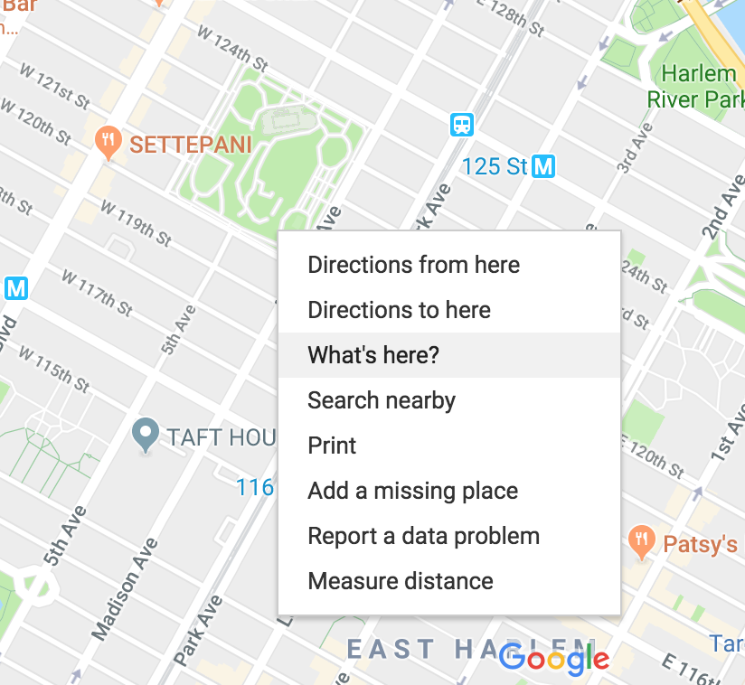
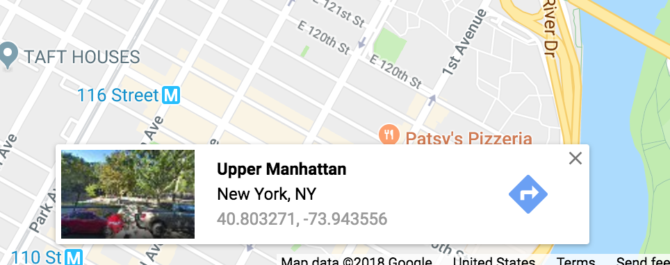

# These are the curl requests I made:

curl "https://api.mapbox.com/geocoding/v5/mapbox.places/-99.133209,19.432608.json?types=poi.landmark&access_token=your_token_here"

curl "https://api.mapbox.com/directions/v5/mapbox/walking/-73.956878,40.801742;-73.876998,40.850684?access_token=your_token_here"

# This is the html I used to test the map:
```html
<html>
<body>

This is a map of New York City, centered on Central Park.


</body>
</html>
```
# Getting Latitude/Longitude:

A quick google search reveals the latitude longitude coordinates for a
given place. You will want to use the pair that represents the N/S and
E/W with positive or negative values, rather than N/S or E/W.
Additionally, you can right-click anywhere on a Google Map and select
"what's here?" on the menu to get latitude longitude.



Choose the coordinates that are listed below, these are the coordinates
that will work with the MapBox API.

