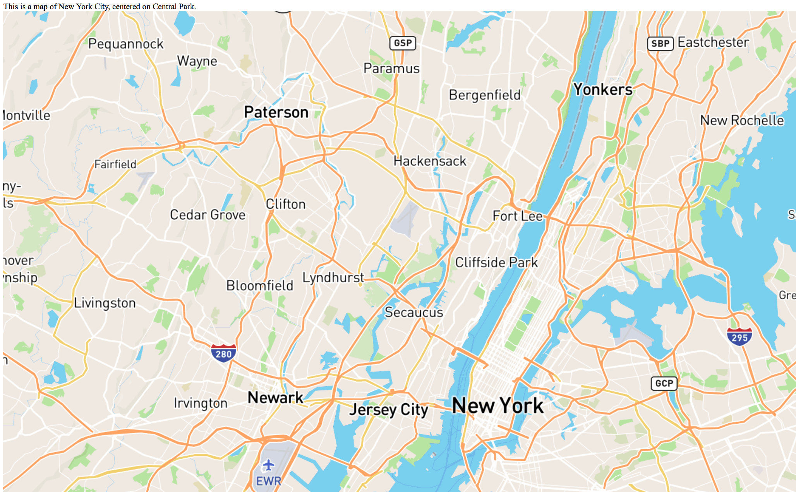

MapBox API

All of these directions are summarized directly from the MapBox
[documentation](https://www.mapbox.com/api-documentation)

I provide an accompanying document with my code examples.

The MapBox API allows programmatic access to MapBox services, such as
geocoding, individual account management, map creation, uploading of
geographic data, driving directions, and reverse geocoding. It supports
HTTP methods: GET, POST, PUT, PATCH, DELETE. Each endpoint has a path,
parameters, a base url and an access token passed as a parameter.

Rate limits:

MapBox does limit requests, but the rate limits changed depending on the
service. Geocoding is no longer free; there are several different
payment plans and associated rate limits.

Example query construction:

Base path:
https://api.mapbox.com

Endpoint path: /geocoding/v5/{mode}/{query}.json

Request URL:
https://api.mapbox.com/geocoding/v5/{mode}/{query}

Access tokens must be requested at your account page:

https://www.mapbox.com/account/

And once you create a token and define a scope, you must be sure to
copy/paste the key immediately, it will be lost once you leave that
page.

# EXAMPLES

## Make a static map in html, centered on Central Park:

```html

```

Importantly, the coordinates are listed "longitude, latitude". Note the
negative sign before the longitude of New York. 9.67 is the zoom level. The two
following values are pitch and bearing, used to either rotate the map or
tilt it for a perspective view. 1000X600 specifies the width (1000) and
height (600), @2x requests a retina 2x image.

It looks like:



## CURL request to find places of interest

We will construct a curl request to find find poi (places of interest) that are also landmarks (type=poi.landmark) near Mexico City (-99.133209,19.432608), in json format (.json).

curl "https://api.mapbox.com/geocoding/v5/mapbox.places/-99.133209,19.432608.json?types=poi.landmark&access_token=your_token_here"

Returns a JSON feature collection:

```json
{"type":"FeatureCollection","query":[-99.133209,19.432608],"features":[{"id":"poi.6666665555734040","type":"Feature","place_type":["poi"],"relevance":1,"properties":{"landmark":true,"wikidata":"Q1348507","category":"landmark","address":"Plaza
de la Constitución
s/n","maki":"monument"},"text":"Zócalo","place_name":"Zócalo,
Plaza de la Constitución s/n, Mexico City, Distrito Federal,
Mexico","center":[-99.133333,19.432778],"geometry":{"type":"Point","coordinates":[-99.133333,19.432778]},"context":[{"id":"locality.17407121999078760","wikidata":"Q20236988","text":"Cuauhtémoc"},{"id":"place.5154037879100080","wikidata":"Q1489","text":"Mexico
City"},{"id":"region.212446","short_code":"MX-DIF","wikidata":"Q1489","text":"Distrito
Federal"},{"id":"country.3124","short_code":"mx","wikidata":"Q96","text":"Mexico"}]}],"attribution":"NOTICE:
© 2017 Mapbox and its suppliers. All rights reserved. Use of this data
is subject to the Mapbox Terms of Service
(https://www.mapbox.com/about/maps/). This response and the information
it contains may not be retained."}
```
## CURL request for walking directions

Get walking directions from one set of long,lat values to another set of long,lat values. You can specify as many stops on the way as you like, as long as they are separated by semi-colons.
"mapbox/walking" specifies they are walking directions. The first set of
coordinates are the starting place, the second are the ending place.
Specifying steps=true will give turn-by-turn directions. The default
is steps=false. You can change the language of the directions, and you
can also specify any kinds of roads to not take.

curl "https://api.mapbox.com/directions/v5/mapbox/walking/-73.956878,40.801742;-73.943220,40.799492?steps=true&access_token=your_token_here"

Returns a JSON object with turns, routes and distances from my house to
Urban Garden Center, walking. The human-language directions are found in the
"instructions" parameter, but the directions that are returned are very
rich, and could be manipulated easily to find interesting parameters
according to MapBox's understanding of directions. (How many steps, how
many turns, the average bearing, etc.) The returned JSON is fairly easy
to understand; distance and duration are in meters and seconds,
respectively, and weight is a value depending on weight_name that gives
penalties for less desirable routes. The default weight_name is
"routability".

The json returned as a result of the above query:

```json
{
  "routes": [
    {
      "geometry": "ua`xFrukbMjUut@mJkGdCaIiCeBzBeH]U",
      "legs": [
        {
          "summary": "West 112th Street, 5th Avenue",
          "weight": 1059.9,
          "duration": 1059.9,
          "steps": [
            {
              "intersections": [
                {
                  "out": 0,
                  "entry": [
                    true
                  ],
                  "bearings": [
                    119
                  ],
                  "location": [
                    -73.956898,
                    40.801714
                  ]
                },
                {
                  "out": 1,
                  "in": 3,
                  "entry": [
                    true,
                    true,
                    true,
                    false
                  ],
                  "bearings": [
                    30,
                    120,
                    210,
                    300
                  ],
                  "location": [
                    -73.954484,
                    40.800695
                  ]
                },
                {
                  "out": 1,
                  "in": 3,
                  "entry": [
                    true,
                    true,
                    true,
                    false
                  ],
                  "bearings": [
                    30,
                    120,
                    210,
                    300
                  ],
                  "location": [
                    -73.9543,
                    40.800617
                  ]
                },
                {
                  "out": 1,
                  "in": 3,
                  "entry": [
                    true,
                    true,
                    true,
                    false
                  ],
                  "bearings": [
                    0,
                    120,
                    180,
                    300
                  ],
                  "location": [
                    -73.952458,
                    40.799843
                  ]
                },
                {
                  "out": 1,
                  "in": 3,
                  "entry": [
                    true,
                    true,
                    true,
                    false
                  ],
                  "bearings": [
                    30,
                    120,
                    210,
                    300
                  ],
                  "location": [
                    -73.951645,
                    40.799507
                  ]
                },
                {
                  "out": 1,
                  "in": 3,
                  "entry": [
                    true,
                    true,
                    true,
                    false
                  ],
                  "bearings": [
                    30,
                    120,
                    210,
                    300
                  ],
                  "location": [
                    -73.951495,
                    40.799445
                  ]
                }
              ],
              "driving_side": "right",
              "geometry": "ua`xFrukbMtAmErBuGNc@zCoJ`AaDJ]fG}R",
              "mode": "walking",
              "maneuver": {
                "bearing_after": 119,
                "bearing_before": 0,
                "location": [
                  -73.956898,
                  40.801714
                ],
                "type": "depart",
                "instruction": "Head southeast on West 112th Street"
              },
              "weight": 598.6,
              "duration": 598.6,
              "name": "West 112th Street",
              "distance": 825.7
            },
            {
              "intersections": [
                {
                  "out": 0,
                  "in": 3,
                  "entry": [
                    true,
                    true,
                    true,
                    false
                  ],
                  "bearings": [
                    30,
                    120,
                    210,
                    300
                  ],
                  "location": [
                    -73.948311,
                    40.798129
                  ]
                }
              ],
              "driving_side": "right",
              "geometry": "ik_xF|_jbMmJkG",
              "mode": "walking",
              "maneuver": {
                "bearing_after": 28,
                "bearing_before": 118,
                "location": [
                  -73.948311,
                  40.798129
                ],
                "modifier": "left",
                "type": "turn",
                "instruction": "Turn left onto 5th Avenue"
              },
              "weight": 167.6,
              "duration": 167.6,
              "name": "5th Avenue",
              "distance": 232.8
            },
            {
              "intersections": [
                {
                  "out": 1,
                  "in": 2,
                  "entry": [
                    true,
                    true,
                    false,
                    true
                  ],
                  "bearings": [
                    30,
                    120,
                    210,
                    300
                  ],
                  "location": [
                    -73.946974,
                    40.799961
                  ]
                }
              ],
              "driving_side": "right",
              "geometry": "wv_xFpwibMdCaI",
              "mode": "walking",
              "maneuver": {
                "bearing_after": 118,
                "bearing_before": 28,
                "location": [
                  -73.946974,
                  40.799961
                ],
                "modifier": "right",
                "type": "turn",
                "instruction": "Turn right onto East 115th Street"
              },
              "weight": 111.8,
              "duration": 111.8,
              "name": "East 115th Street",
              "distance": 155.2
            },
            {
              "intersections": [
                {
                  "out": 0,
                  "in": 3,
                  "entry": [
                    true,
                    true,
                    true,
                    false
                  ],
                  "bearings": [
                    30,
                    120,
                    210,
                    300
                  ],
                  "location": [
                    -73.945361,
                    40.799285
                  ]
                }
              ],
              "driving_side": "right",
              "geometry": "qr_xFnmibMiCeB",
              "mode": "walking",
              "maneuver": {
                "bearing_after": 28,
                "bearing_before": 118,
                "location": [
                  -73.945361,
                  40.799285
                ],
                "modifier": "left",
                "type": "turn",
                "instruction": "Turn left onto Madison Avenue"
              },
              "weight": 63.8,
              "duration": 63.8,
              "name": "Madison Avenue",
              "distance": 88.6
            },
            {
              "intersections": [
                {
                  "out": 1,
                  "in": 2,
                  "entry": [
                    true,
                    true,
                    false,
                    true
                  ],
                  "bearings": [
                    30,
                    120,
                    210,
                    300
                  ],
                  "location": [
                    -73.944851,
                    40.799982
                  ]
                }
              ],
              "driving_side": "right",
              "geometry": "{v_xFhjibMzBeH",
              "mode": "walking",
              "maneuver": {
                "bearing_after": 118,
                "bearing_before": 28,
                "location": [
                  -73.944851,
                  40.799982
                ],
                "modifier": "right",
                "type": "turn",
                "instruction": "Turn right onto East 116th Street"
              },
              "weight": 104.1,
              "duration": 104.1,
              "name": "East 116th Street",
              "distance": 141.8
            },
            {
              "intersections": [
                {
                  "out": 0,
                  "in": 3,
                  "entry": [
                    true,
                    true,
                    true,
                    false
                  ],
                  "bearings": [
                    30,
                    120,
                    210,
                    300
                  ],
                  "location": [
                    -73.943381,
                    40.79936
                  ]
                }
              ],
              "driving_side": "right",
              "geometry": "_s_xFbaibM]U",
              "mode": "walking",
              "maneuver": {
                "bearing_after": 28,
                "bearing_before": 118,
                "location": [
                  -73.943381,
                  40.79936
                ],
                "modifier": "left",
                "type": "turn",
                "instruction": "Turn left onto Park Avenue"
              },
              "weight": 14,
              "duration": 14,
              "name": "Park Avenue",
              "distance": 19.4
            },
            {
              "intersections": [
                {
                  "in": 0,
                  "entry": [
                    true
                  ],
                  "bearings": [
                    209
                  ],
                  "location": [
                    -73.94327,
                    40.799513
                  ]
                }
              ],
              "driving_side": "right",
              "geometry": "}s_xFl`ibM",
              "mode": "walking",
              "maneuver": {
                "bearing_after": 0,
                "bearing_before": 29,
                "location": [
                  -73.94327,
                  40.799513
                ],
                "type": "arrive",
                "instruction": "You have arrived at your destination"
              },
              "weight": 0,
              "duration": 0,
              "name": "Park Avenue",
              "distance": 0
            }
          ],
          "distance": 1463.5
        }
      ],
      "weight_name": "duration",
      "weight": 1059.9,
      "duration": 1059.9,
      "distance": 1463.5
    }
  ],
  "waypoints": [
    {
      "name": "West 112th Street",
      "location": [
        -73.956898,
        40.801714
      ]
    },
    {
      "name": "Park Avenue",
      "location": [
        -73.94327,
        40.799513
      ]
    }
  ],
  "code": "Ok",
  "uuid": "cjdc0k2do00ay41p7bxnlagzw"
}
```