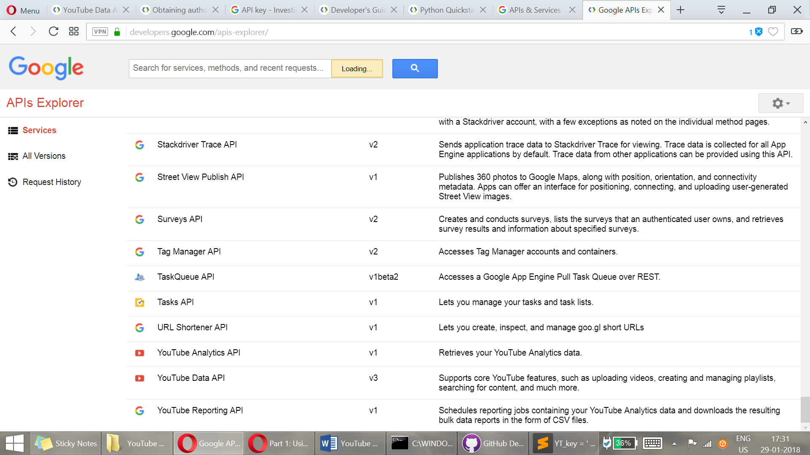
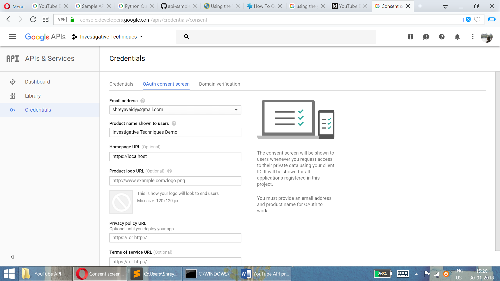
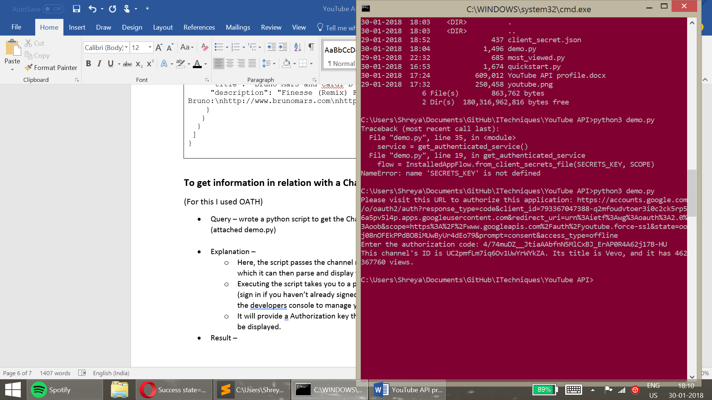

<h1> YouTube API Profile </h1>

YouTube Data API v3 is an effective way to gain access to YouTube
videos, channels, search through videos, modify certain fields and so
on. There are four APIs related to YouTube that Google offers – YouTube
Data API v3, YouTube Reporting API, YouTube Analytics API, YouTube Ads
Reach API. For this assignment, I have concentrated mainly on the
YouTube Data API v3.



Figure 1- YouTube APIs list

YouTube APIs have a quota that restricts the amount of (calls) usage of
the API and the default for a project is 1 million units per day. You
can also view your quota/usage in the developer console. “The YouTube
Data API uses a quota to ensure that developers use the service as
intended and do not create applications that unfairly reduce service
quality or limit access for others.” is stated on the website.

**Guide to/workflow of using the API**

-   To gain access you have to first go to the Google Developer’s
    Console (<https://console.developers.google.com/apis>)– and create a
    new project (or use your existing project if any).

-   In order to work on the API, search for the ‘YouTube Data API’ and
    enable it.

-   This will lead you to a developer’s page for this project where you
    can obtain developer key to use on the API calls. You can access the
    YouTube Data API with authentication for certain functionalities or
    without it too.

-   Install Google APIs Client Library for Python in your machine with
    the command:

> pip3 install --upgrade google-api-python-client

-   Install Google OATH libraries and http2lib with the command:  
    pip3 install --upgrade google-auth google-auth-oauthlib
    google-auth-httplib2

1.  *To use without OATH authentication*

-   Click on Credentials to get your Developer Key to authenticate your
    API calls.

1.  *To use with OATH authentication*

    -   OATH here lets you write code to act on behalf of a Google
        account holder.

    -   To get OATH authentication, click on the Credentials button and
        choose ‘Oath consent’ which will lead you to a page where you
        can enter details of the project. Here you can get your key and
        secret which you will store as a .py or .json file. (You can
        also download the client\_secret.json from the page itself
        for usage)

> 

Figure 2- Getting credentials for your project

To start writing Queries for the YouTube API, you must be familiar with
two parameters for usage that is given by YouTube – (specific to only
YouTube I think)

-   part – this parameter helps to identify groups of properties that
    should be returned for a resource. \[required parameter\]

-   fields – filters the API response to only return specific properties
    within the requested resource parts. Let’s you filter responses –
    which the ‘part’ parameter doesn’t allow you to do.

*(Detailed description of every field and usage of these parameters is
provided under the section ‘Partial resources’ on this page of the
YouTube Documentation -*
[*https://developers.google.com/youtube/v3/getting-started*](https://developers.google.com/youtube/v3/getting-started)*)
*

**To get information of a video on YouTube**

I choose a YouTube videos of my liking and decided to get
information/details pertaining to it using the API.

-   **Query 1** 
Video used -   (https://www.youtube.com/watch?v=wY64gIIm0Ys)

> [https://www.googleapis.com/youtube/v3/videos?id=wY64gIIm0Ys&key=”YOUR\_DEVELOPER\_KEY”&part=snippet,contentDetails,statistics,status](https://www.googleapis.com/youtube/v3/videos?id=wY64gIIm0Ys&key=”YOUR_DEVELOPER_KEY”&part=snippet,contentDetails,statistics,status)

-   **Explanation** –

    -   API call accesses the video with ‘id’ (wY64gIIm0Ys)

    -   Key – “YOUR\_DEVELOPER\_KEY” (without OATH)

    -   Part - I have passed
     1. “snippet” – Gives Channel ID, Video name, thumbnails etc.
     2. “contentDetails” – Gives the kind of request items, duration, caption etc.
     3.  “statistics” – gives the number of views, likes, favourites and comments.
     4. “status” – Gives the status of the upload, privacy details,
            embeddable status and license.

-   **Result** -

```
{                                                                                                                                                                                                                                                                         "kind": "youtube\#videoListResponse",                                                                                                                                                               
 "etag": "\\"Wu2llbfqCdxIVjGbVPm2DslKPCA/6D9AcRMFDoqN7Q5jrTCDUiCUgqc\\"",                                                                                                                             
 "pageInfo": {                                                                                                                                                                                                                                                                                                                                 
 "totalResults": 1,                                                                                                                                                                                   
 "resultsPerPage": 1                                                                                                                                                                                                                                                                                                                       
 },                                                                                                                                                                                                                                                                                                                                    
 "items": \[                                                                                                                          
 {                                                                                                                                                                                                
 "kind": "youtube\#video",                                                                                                                                                                   
 "etag": "\\"Wu2llbfqCdxIVjGbVPm2DslKPCA/kgwSBaO6THWwWjWmRqNkRK0WWOo\\"",                                                                                                                        
 "id": "wY64gIIm0Ys",                                                                                                                                                                              
 "snippet": {                                                                                                                                                                                        
 "publishedAt": "2015-02-09T12:27:20.000Z",                                                                                                                                                      
 "channelId": "UCkGxgZZw4mZ4zjgU69BkLlw",                                                                                                                                                              
 "title": "Bombay Jayashree Vocal || Carnatic Classical ||",                                                                                                                                         
 "description": "Listen : Bombay Jayashree Vocal. This jukebox includes 8 Musical Tracks.\\n\\nClick Here to Share on Facebook:http://on.fb.me/1CuKX1Y\\n\\n\\nAlbum name : Bombay Jayashree Vocal\\nSinger : Bombay Jayashree\\nLyrics : Thyagaraja\\n\\n----------------------------------------------------------------------------------------\\nEnjoy and Stay connect with us\\n►Subscribe us for Exclusive Carnatic Videos - http://bit.ly/1z3YVGu\\n►Like us: http://www.facebook.com/devotionalNcl...\\n►Follow us : http://www.twitter.com/adityamusic\\n►Circle us : https://plus.google.com/+carnaticclas...\\n\\nSUBSCRIBE Aditya Music Channels for unlimited entertainment :\\n►For Latest Music :http://bit.ly/adityamusic\\n►For New Movies in HD : http://www.youtube.com/Adityamovies\\n►For Songs with Lyrics : https://www.youtube.com/AdityaMusicNM...\\n►For Devotional Songs : http://www.youtube.com/AdityaDevotional\\n►For Kids Educational : http://www.youtube.com/AdityaKids\\n\\n© 2015 Aditya Music India Pvt. Ltd.",  
                                                             
 "thumbnails": {                                                                                                                                                                            
 "default": {                                                                                                                                                                                         
 "url": "https://i.ytimg.com/vi/wY64gIIm0Ys/default.jpg",                                                                                                                                                                                                                                                                      
 "width": 120,                                                                                                                                                                                        
 "height": 90                                                                                                                                                                                         
 },                                                                                                                                                                                             
 "medium": {                                                                                                                                                                                                                                                                                                                            
 "url": "https://i.ytimg.com/vi/wY64gIIm0Ys/mqdefault.jpg",                                                                                                                                                                                                                                                                               
 "width": 320,                                                                                                                                                                                                                                                                                                                                
 "height": 180                                                                                                                                                                                        
 },                                                                                                                                                                                                
 "high": {                                                                                                                                                                                                                                                                                                                                 
 "url": "https://i.ytimg.com/vi/wY64gIIm0Ys/hqdefault.jpg",                                                                                                                                                                                                                                                                               
 "width": 480,                                                                                                                                                                                                                                                                                                                                                                                                                                                                    
 "height": 360                                                                                                                                                                                     
 },                                                                                                                                                                                                  
 "standard": {                                                                                                                                                                                                                                                                                                                                 
 "url": "https://i.ytimg.com/vi/wY64gIIm0Ys/sddefault.jpg",                                                                                                                                                                                                                                                                                 
 "width": 640,                                                                                                                                                                                                                                                                                                                                
 "height": 480                                                                                                                                                                                                                                                                                                                                
 },                                                                                                                                   
 "maxres": {                                                                                                                                                                                        
 "url": "https://i.ytimg.com/vi/wY64gIIm0Ys/maxresdefault.jpg",                                                                                                                                  
 "width": 1280,                                                                                                                                                                                                                                                                                                                            
 "height": 720                                                                                                                                                                                                                                                                                                                             
 }                                                                                                                                                                                                                                                                                                                                           
 },                                                           
 "channelTitle": "Carnatic Classical",                                                                                                                                                                 
 "tags": \[                                                                                                                                                                                           
 "bombay jayasree classical songs",                                                                                                                                                                   
 "bombay sisters soundarya lahari",                                                                                                                                                                   
 "bombay sisters lalitha sahasranamam",                                                                                                                                                               
 "devotional songs by yesudas bombay sisters",                                                                                                                                                         
 "devotional songs by yesudas",                                                                                                                                                                       
 "devotional songs by ms subbulakshmi",                                                                                                                                                               
 "devotional songs by sp balasubramaniam",                                                                                                                                                             
 "carnatic music",                                                                                                                                                                                     
 "carnatic classical music vocal",                                                                                                                                                                     
 "carnatic classical music instrumental",                                                                                                                                                             
 "carnatic classical songs",                                                                                                                                                                           
 "best carnatic classical songs",                                                                                                                                                                     
 "jayasree classical songs",                                                                                                                                                                           
 "classical music"                                                                                                                                                                                     
 \],                                                                                                                                                                                                   
 "categoryId": "10",                                                                                                                                                                                   
 "liveBroadcastContent": "none",                                                                                                                                                                       
 "localized": {                                                                                                                                                                                       
 "title": "Bombay Jayashree Vocal || Carnatic Classical ||",                                                                                                                                           
 "description": "Listen : Bombay Jayashree Vocal. This jukebox includes 8 Musical Tracks.\\n\\nClick Here to Share on Facebook:http://on.fb.me/1CuKX1Y\\n\\n\\nAlbum name : Bombay Jayashree Vocal\\nSinger : Bombay Jayashree\\nLyrics : Thyagaraja\\n\\n----------------------------------------------------------------------------------------\\nEnjoy and Stay connect with us\\n►Subscribe us for Exclusive Carnatic Videos - http://bit.ly/1z3YVGu\\n►Like us: http://www.facebook.com/devotionalNcl...\\n►Follow us : http://www.twitter.com/adityamusic\\n►Circle us : https://plus.google.com/+carnaticclas...\\n\\nSUBSCRIBE Aditya Music Channels for unlimited entertainment :\\n►For Latest Music :http://bit.ly/adityamusic\\n►For New Movies in HD : http://www.youtube.com/Adityamovies\\n►For Songs with Lyrics : https://www.youtube.com/AdityaMusicNM...\\n►For Devotional Songs : http://www.youtube.com/AdityaDevotional\\n►For Kids Educational : http://www.youtube.com/AdityaKids\\n\\n© 2015 Aditya Music India Pvt. Ltd."                                                 
 }                                                                                                                                                                                                     
 },                                                                                                                                                                                                   
 "contentDetails": {                                                                                                                                                                                   
 "duration": "PT1H1M3S",                                                                                                                                                                               
 "dimension": "2d",                                                                                                                                                                                   
 "definition": "hd",                                                                                                                                                                                   
 "caption": "false",                                                                                                                                                                                   
 "licensedContent": true,                                                                                                                                                                             
 "projection": "rectangular"                                                                                                                                                                           
 },                                                                                                                                                                                                   
 "status": {                                                                                                                                                                                           
 "uploadStatus": "processed",                                                                                                                                                                         
 "privacyStatus": "public",                                                                                                                                                                           
 "license": "youtube",                                                                                                                                                                                 
 "embeddable": true,                                                                                                                                                                                   
 "publicStatsViewable": true                                                                                                                                                                           
 },                                                                                                                                                                                                   
 "statistics": {                                                                                                                                                                                       
 "viewCount": "343824",                                                                                                                                                                               
 "likeCount": "1089",                                                                                                                                                                                 
 "dislikeCount": "130",                                                                                                                                                                               
 "favoriteCount": "0",                                                                                                                                                                                 
 "commentCount": "126"                                                                                                                                                                                 
  }                                                            
 }                                                            
\]                                                                                                                                                                                                  
 }
 
 ```

- ** Query 2 – ** 

Video used - (https://www.youtube.com/watch?v=6OcOO1k-vGE)

> [https://www.googleapis.com/youtube/v3/videos?id=6OcOO1k-vGE&key=”YOUR\_DEVELOPER\_KEY”
&part=snippet,statistics&fields=items(id,snippet)](https://www.googleapis.com/youtube/v3/videos?id=6OcOO1k-vGE&key=)

-   **Explanation ** –

    -   API call accesses the video with ‘id’ (6OcOO1k-vGE)

    -   Key – “YOUR\_DEVELOPER\_KEY”

    -   Part - I passed snippet and statistics

    -   Fields – Filters out (removes) kind and etag from the response

-   **Result** –

```
| {                                                                                                                                                                                                                                                                                                                                                                                                         
 "items": \[                                                                                                                                                                                                                                                                                                                                                                                                       
 {                                                                                                                                                                                                                                                                                                                                                                                                                 
 "id": "6OcOO1k-vGE",                                                                                                                                                                                                                                                                                                                                                                                             
 "snippet": {                                                                                                                                                                                                                                                                                                                                                                                                     
 "publishedAt": "2018-01-29T09:49:15.000Z",                                                                                                                                                                                                                                                                                                                                                                       
 "channelId": "UC2pmfLm7iq6Ov1UwYrWYkZA",                                                                                                                                                                                                                                                                                                                                                                         
 "title": "Bruno Mars and Cardi B - Finesse (LIVE From The 60th GRAMMYs ®)",                                                                                                                                                                                                                                                                                                                                       
 "description": "Finesse (Remix) Feat. Cardi B Available Now: https://Atlantic.lnk.to/FinesseRemixID \\n \\nConnect with Bruno:\\nhttp://www.brunomars.com\\nhttp://www.instagram.com/brunomars\\nhttp://www.twitter.com/brunomars\\nhttp://www.facebook.com/brunomars",  
                                                                                                                                 
 "thumbnails": {                                                                                                                                                                                                                                                          
                                                                                                                                 
 "default": {                                                                                                                                                                                                                                                             
                                                                                                                                 
 "url": "https://i.ytimg.com/vi/6OcOO1k-vGE/default.jpg",                                                                                                                                                                                                                 
                                                                                                                                 
 "width": 120,                                                                                                                                                                                                                                                                                                                                                                                                     
 "height": 90                                                                                                                                                                                                                                                                                                                                                                                                     
 },                                                                                                                                                                                                                                                                                                                                                                                                               
 "medium": {                                                                                                                                                                                                                                                              
                                                                                                                                 
 "url": "https://i.ytimg.com/vi/6OcOO1k-vGE/mqdefault.jpg",                                                                                                                                                                                                               
                                                                                                                                 
 "width": 320,                                                                                                                                                                                                                                                                                                                                                                                                     
 "height": 180                                                                                                                                                                                                                                                            
 },                                                                                                                                                                                                                                                                                                                                                                                                               
 "high": {                                                                                                                                                                                                                                                                                                                                                                                                         
 "url": "https://i.ytimg.com/vi/6OcOO1k-vGE/hqdefault.jpg",                                                                                                                                                                                                                                                                                                                                                       
 "width": 480,                                                                                                                                                                                                                                                                                                                                                                                                     
 "height": 360                                                                                                                                                                                                                                                            
                                                                                                                                 
 },                                                                                                                                                                                                                                                                                                                                                                                                               
 "standard": {                                                                                                                                                                                                                                                                                                                                                                                                     
 "url": "https://i.ytimg.com/vi/6OcOO1k-vGE/sddefault.jpg",                                                                                                                                                                                                                                                                                                                                                       
 "width": 640,                                                                                                                                                                                                                                                                                                                                                                                                     
 "height": 480                                                                                                                                                                                                                                                                                                                                                                                                     
 },                                                                                                                                                                                                                                                                       
 "maxres": {                                                                                                                                                                                                                                                                                                                                                                                                       
 "url": "https://i.ytimg.com/vi/6OcOO1k-vGE/maxresdefault.jpg",                                                                                                                                                                                                                                                                                                                                                   
 "width": 1280,                                                                                                                                                                                                                                                                                                                                                                                                   
 "height": 720                                                                                                                                                                                                                                                            
                                                                                                                                 
 }                                                                                                                                                                                                                                                                                                                                                                                                                 
 },                                                                                                                                                                                                                                                                       
                                                                                                                                 
 "channelTitle": "Vevo",                                                                                                                                                                                                                                                                                                                                                                                           
 "tags": \[                                                                                                                                                                                                                                                               
                                                                                                                                                                                                                                                                          
 "Bruno Mars and Cardi B Finesse R&B"                                                                                                                                                                                                                                     
                                                                                                                                                                                                                                                                          
 \],                                                                                                                                                                                                                                                                      
                                                                                                                                                                                                                                                                          
 "categoryId": "10",                                                                                                                                                                                                                                                      
                                                                                                                                                                                                                                                                          
 "liveBroadcastContent": "none",                                                                                                                                                                                                                                          
                                                                                                                                                                                                                                                                          
 "localized": {                                                                                                                                                                                                                                                           
                                                                                                                                                                                                                                                                          
 "title": "Bruno Mars and Cardi B - Finesse (LIVE From The 60th GRAMMYs ®)",                                                                                                                                                                                              
                                                                                                                                                                                                                                                                          
 "description": "Finesse (Remix) Feat. Cardi B Available Now: https://Atlantic.lnk.to/FinesseRemixID \\n \\nConnect with Bruno:\\nhttp://www.brunomars.com\\nhttp://www.instagram.com/brunomars\\nhttp://www.twitter.com/brunomars\\nhttp://www.facebook.com/brunomars"   
                                                                                                                                                                                                                                                                          
 }                                                                                                                                                                                                                                                                        
                                                                                                                                                                                                                                                                          
 }                                                                                                                                                                                                                                                                        
                                                                                                                                                                                                                                                                          
 }                                                                                                                                                                                                                                                                        
                                                                                                                                                                                                                                                                          
 \]                                                                                                                                                                                                                                                                       
                                                                                                                                                                                                                                                                          
 }                                                                                                                                       
```                                                                                                                               


<h3> To get information in relation with a Channel ID </h3>

**Here I chose the channel – VEVO.**

**(For this I used OATH)**

-   Query – wrote a python script to get the Channel ID and number of
    views from a channel. (attached demo.py)

    -   Line from code that gets Channel ID for Vevo using ‘forUsername’
        parameter

> channels\_list\_by\_username(service,part='snippet,contentDetails,statistics',forUsername='Vevo'

-   Explanation –

    -   Here, the script passes the channel name and asks for the
        snippet, ID and views which it can then parse and display to
        the terminal.

    -   Executing the script takes you to a page where you can choose
        your Google Account (sign in if you haven’t already signed in)
        and then allow this Project you created in the developers’
        console to manage your YouTube account.

    -   It will provide Authorization key that you input into the
        terminal and the result will be displayed.

-   Result –

    “This channel's ID is UC2pmfLm7iq6Ov1UwYrWYkZA. Its title is Vevo,
    and it has 462

    367760 views.”




<h2> Process LOG </h2>

1.  Started from the YouTube Data API Documentation page – Getting
    started (<https://developers.google.com/youtube/v3/getting-started>)

    1.  In Google’s usual manner of extensive documentation, there are
        several parts of the website and other webpages that seem to
        describe a process to use the API which was confusing in
        the beginning. I found a Quick start guide at
        <https://developers.google.com/youtube/v3/quickstart/python> and
        a Python developer’s guide for API clients –
        <https://developers.google.com/api-client-library/python/>

> These took an extensive amount of time to read through and just sort
> out what was relevant to the YouTube Data API.

1.  I followed the steps in the guide to get a developer’s key and
    authentication

2.  Stored the secret key and information on my local machine.

3.  Went through the samples to use YouTube API and the documentation
    had several confusing and complicated examples for
    various functions. I decided to try out the examples on my machine
    and understand their working.

4.  Chose to concentrate on a Channel ID and obtaining information of a
    specific chosen video (of my choice) and then

5.  Wrote scripts in python to execute operations to access the Data API
    and tried to manipulate some of the fields to see how the results
    differ or not.

6.  I also referred to other tutorials on the internet -
    <https://medium.com/greyatom/youtube-data-in-python-6147160c5833>
    and
    <https://www.programmableweb.com/news/how-to-query-youtube-through-its-python-apis/how-to/2014/03/26>


